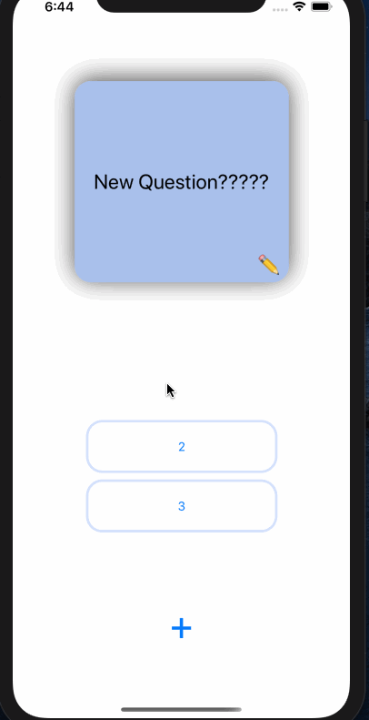

## Flashcards

## Lab 2

### App Description
A flashcard App where you can add new flashcards and edit them. Click on the question to find out the answer!

### App Walk-though

 

## Required
- [x] User can open the creation screen
- [x] User can cancel out of the creation screen
- [x] User can enter a new question and answer in the creation screen to then show it on the flashcard
- [x] Push code to GitHub
## Optional
- [x] User gets an error if they try to create a new flashcard with no question or answer
- [x] User can edit existing flashcard
- [x] User can add multiple choice answers in the creation screen

